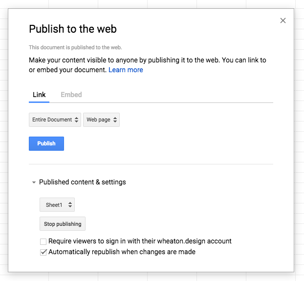

While prototyping a new web app or feature, you often need test data to fill out a view. The usual approach is to create a quick JavaScript object or JSON file, which works well enough.

To a point. After you have more than a few items, it's difficult to find the one you're looking for as the object grows. Then you realize another property is needed and you'll have to add it to each item individually.

Even with a small dataset, it's quickly unmaintainable.

I ran into this problem while building a prototype view for [Lurn](https://lurn.today). I went in search of a spreadsheet-like interface for editing JSON files and came across a better alternative. It turns out that Google Sheets can be accessed in JSON format via a public URL. Not only does this provide a quick way to create and maintain data, it even opens up the possibility of having others edit the data like a mini-CMS or accepting user input via [Google Forms](https://www.google.com/forms/about/).

Want to jump ahead to the final result? Here's a [CodeSandbox demo](https://codesandbox.io/s/rmlmx2ymlq).

Let's get started.

## Creating and publishing your data

Start off by going to [Google Sheets](https://docs.google.com/spreadsheets/) and creating a blank spreadsheet. For each column, use a camelCase heading so that it can be easily accessed later as `row.myColumnHeader`. You’ll also want an ID column to use as the [unique key](https://reactjs.org/docs/lists-and-keys.html#keys) for each item when rendering a list.


With the data in place, go to the File menu and select ‘Publish to the web’. The default settings are fine, so you can go ahead and click Publish.



## Retrieving your data

Now that you’ve saved your spreadsheet and have its unique key, you can point your browser to a URL in this format:

```javascript
https://spreadsheets.google.com/feeds/cells/SPREADSHEET_KEY/1/public/full?alt=json
```

Your data is there in glorious JSON! Actually, the structure is a bit of a mess.

Fortunately, there’s a project called [Tabletop.js](https://github.com/jsoma/tabletop) that makes Google Sheets data easier to parse. Even better, someone has done us the favor of creating a service to run the script and return clean JSON: https://spreadsheet.glitch.me/

So rather than getting the data directly from Google, use a URL in this format:

```javascript
https://spreadsheet.glitch.me/?key=SPREADSHEET_KEY
```

## Rendering the React component

You're almost there! Let's get the data into your React application.

In whichever component will display the data, start by adding an empty array to the state. This is where you'll place the items from the spreadsheet as they are loaded in.

```
class App extends Component {
  state = {
    items: []
  };
```

When you want a React component to request external data, `componentDidMount` is the place to kick off that request. Create that method and add a fetch() that will request the data and put it into your component’s state.

```
  componentDidMount() {
    fetch(`https://spreadsheet.glitch.me/?key=SPREADSHEET_KEY`)
      .then(response => response.json())
      .then(items => this.setState({ items }))
      .catch(error => console.log("Error fetching data:", error));
  }
```

Now in the render method, you can get the items from state and map over them.

```
  render() {
    const { items } = this.state;

    if (!items.length) {
      return <p>Loading...</p>;
    }

    return (
      <div>
        <p>Loaded {items.length} rows from Google Sheets:</p>
        <ol>
          {items.map(item => (
            <li key={item.id}>{item.title}</li>
          ))}
        </ol>
      </div>
    );
  }
```

Note that there's a loading message to display while the array is empty. The [Fetch API](https://developer.mozilla.org/en-US/docs/Web/API/Fetch_API) is asynchronous, and it may take a few seconds to get the response back and re-render the component.

Once the data comes back, the `items` array will contain an object for each row of your spreadsheet. There is a corresponding property for each column, which you can access like `item.title`.

That’s it! You have a React component pulling data from a spreadsheet. This isn’t going to scale well for a large application, but for a quick prototype you now have a much easier way to build up test data and maintain it over time.

See it in action in this [CodeSandbox demo](https://codesandbox.io/s/rmlmx2ymlq).

## Exercises and further reading

Want to take it to the next level?

- Create a [Google Form](https://www.google.com/forms/about/) that adds data to your spreadsheet.
- Add [Tabletop.js](https://github.com/jsoma/tabletop) to your project for improved performance.
- If the request fails, display an error instead of the loading message.
