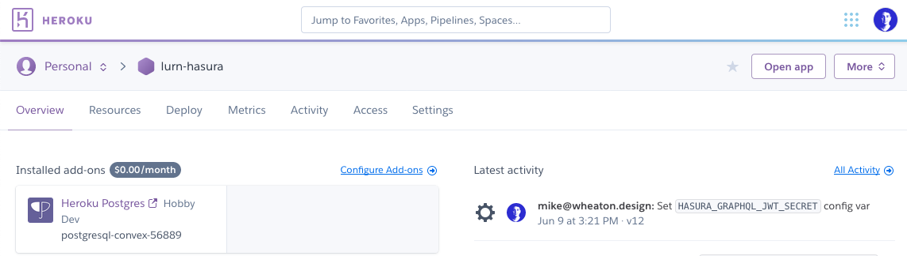
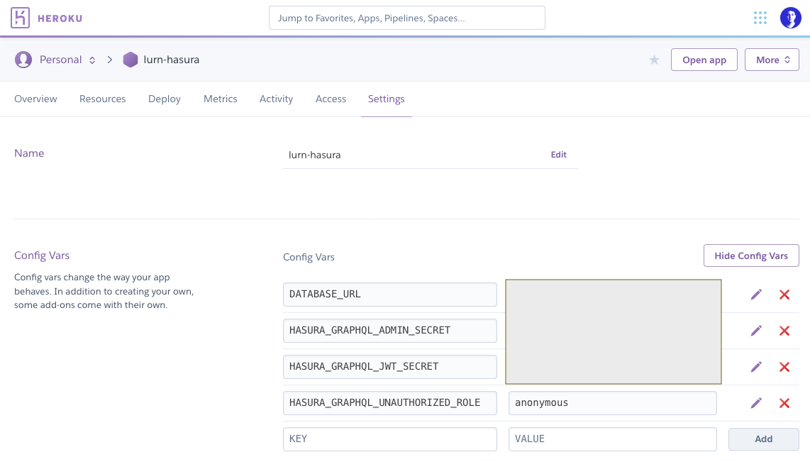
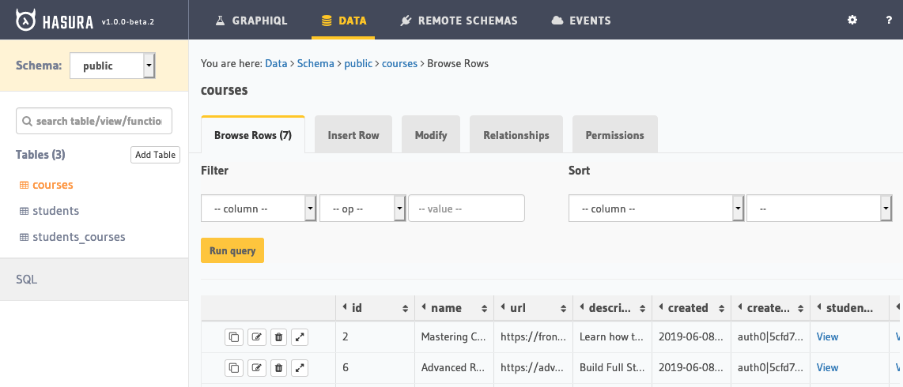
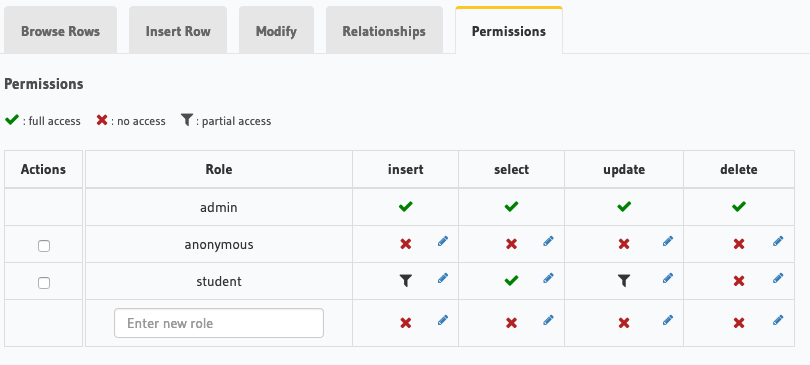
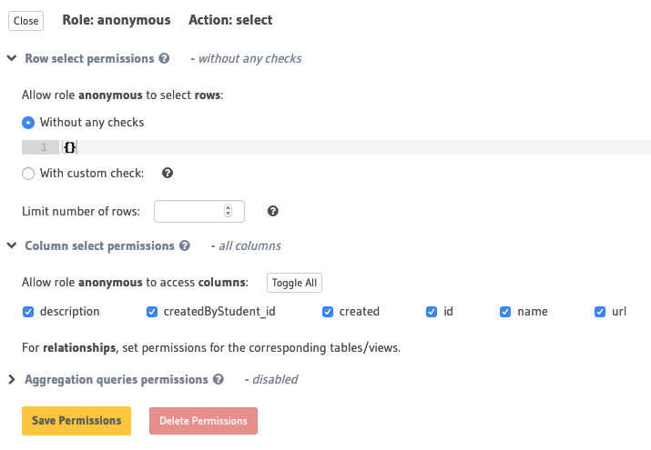

Lately, I've been working on a side project, [Lurn](https://lurn.today). It's an app to track the online courses you're taking and see what others are taking. Think GoodReads for courses.

One of my goals with this side project is to learn how to use GraphQL to set up a backend, and I've found [Hasura](https://hasura.io/) to be the fastest and most intuitive way to do so. I spent less than an hour getting it set up on Heroku, modeling out relational data, and successfully querying and modifying it with GraphQL. Wow!

While I could query the data from Hasura's built-in [GraphiQL](https://github.com/graphql/graphiql), I received errors when attempting to connect to it with [React Apollo](https://github.com/apollographql/react-apollo). The endpoint rejected my request because it wasn't coming from an authenticated user. But what about apps that don't require signing in?

## Hasura rejects unauthenticated users

Hasura uses [roles](https://docs.hasura.io/1.0/graphql/manual/auth/authorization/roles-variables.html) to determine who has permissions to read, insert, update, and delete data.

It turns out that Hasura (sensibly) rejects all unauthenticated requests to the GraphQL endpoint. This prevents someone from gaining access to private data or flooding the server with requests, but it's not helpful for an app that should accessible to signed-out users.

Fortunately, they provide a means of configuring a default role for unauthenticated users. Let's get that working.

## Configure Hasura's unauthenticated role

Let's change Hasura's default behavior, so that requests from unauthenticated users are assigned a default security role rather than rejected outright.

Sign in to Heroku and select your Hasura app. If you're new to Hasura, [quick start guide](https://docs.hasura.io/1.0/graphql/manual/getting-started/heroku-simple.html) will have you up-and-running in a few minutes.

Navigate to the Settings tab and click 'Reveal Config Vars' to show your app's configuration variables. Add a new variable with a key of `HASURA_GRAPHQL_UNAUTHORIZED_ROLE` and a value of whatever you want to call that role, such as `anonymous`.

Click 'Open app' to launch the Hasura console and continue with the next section.

## Set permissions on tables

Select 'Data' and then choose a table you want to be publicly accessible.

Select the 'Permissions' tab and enter a new role. This name **must match the value of your configuration variable** from earlier. In my case, it's `anonymous`.

You'll see the new role added to the table. By default, permissions are blocked for all action types (insert, select, update, and delete) as indicated by the X icon.

Click the pencil in the 'select' column. In almost all cases, you should leave the default (blocked) permissions for insert, update, and delete.

Under 'Row select permissions' choose 'Without any checks'. For 'Column select permissions' choose the columns that should be available in queries. I've selected all of them.

Click 'Save permissions' and you're all set. Repeat this process for any other tables that should be accessible to signed-out users. You can now query your GraphQL endpoint without logging in!
