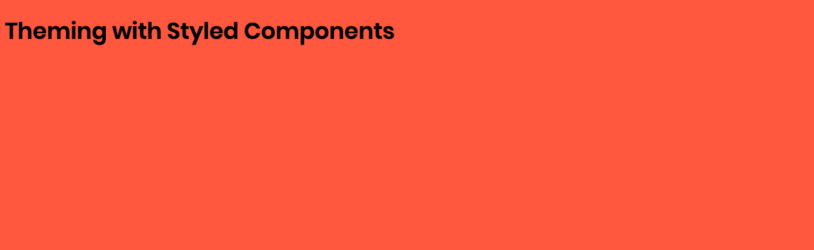
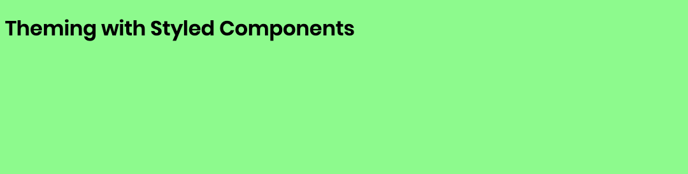

This post covers the basics of creating a [Styled Components](https://www.styled-components.com/) theme.

A theme contains definitions for colors, fonts, shadows, text sizes, and other visual elements that you want to use consistently. Changes to the theme are reflected everywhere, and you can even modify it at runtime to provide functionality like a dark mode toggle.

I'll be using [CodeSandbox](https://codesandbox.io/) for this tutorial. It's my go-to for creating simple proof-of-concept apps that can be easily shared. You can code along with me, or jump ahead to the [final app](https://codesandbox.io/s/jjxrwl48xw) if you'd prefer.

Let's get started!

## Project set up

Create a new app on [CodeSandbox](https://codesandbox.io/) using the React template with create-react-app.

This template comes with some boilerplate we don't need. Delete the `styles.css` file and remove its import from `index.js`, then replace the headings with "Theming with Styled Components".

Click the "Add Dependency" button and search for `styled-components`. And just like that, we're ready to use Styled Components in our app.

## Global styles

Styled Components is used to, well, add styles to components. However, there are situations that require defining global CSS styles that apply to the entire app rather than a specific component. These include defining custom fonts and styling the `html` and `body` elements.

While we could add these styles in a regular CSS file, we'd miss out on the benefit of having our visual language defined in a central place. Fortunately, Styled Components provides a `createGlobalStyle` function that can add global styles to our app. Let's create a component that will be responsible for adding this styles.

Create a new file, `GlobalStyles.js`.

```javascript
import { createGlobalStyle } from 'styled-components';

const GlobalStyles = createGlobalStyle`
  @import url('https://fonts.googleapis.com/css?family=Poppins:400,600');

  body {
    background-color: tomato;
    font-family: Poppins, sans-serif;
  }
`;

export default GlobalStyles;
```

This creates a global style that defines a custom font, applies it to the body, and sets the background color to a lovely shade of red.

To apply these styles, edit `App.js` to add our new component.

```javascript
import GlobalStyles from './GlobalStyles';

function App() {
  return (
    <div className="App">
      <GlobalStyles />
      <h1>Theming with Styled Components</h1>
    </div>
  );
}
```

Success! The font is in use and our background is very, very red.



We're off to a good start. But our global styles contain hard-coded values, which we have no way of sharing with other components or updating easily. Let's create a theme to hold these values.

## Creating the theme

A theme is a JavaScript object that all of our components will have access to via a prop. There are no requirements or limitations on its structure; we can put anything at all in there.

Let's add a `theme.js` to hold this object, since it will grow over time.

```javascript
const theme = {
  fontSource: 'https://fonts.googleapis.com/css?family=Poppins:400,600',
  fontFamily: 'Poppins, sans-serif',
  backgroundColor: 'tomato',
};

export default theme;
```

This object has strings for our font source, font family name, and the background color. Our next step will be to update the `GlobalStyles` component to use these values.

## Making the theme available

We have a theme, but how can our components like GlobalStyles access it? While a standard import statement would work for sharing the values, it wouldn't allow us to update them at runtime to enable functionality like a dark mode.

This is where `ThemeProvider` comes in. It's a wrapper component that passes a theme prop to all of the components within it.

```javascript
import { ThemeProvider } from 'styled-components';

import GlobalStyles from './GlobalStyles';
import theme from './theme';

function App() {
  return (
    <ThemeProvider theme={theme}>
      <div className="App">
        <GlobalStyles />
        <h1>Theming with Styled Components</h1>
      </div>
    </ThemeProvider>
  );
}
```

We've imported `ThemeProvider`, wrapped it around the entire app, and passed our theme object to it. All of our components will now have access to a `theme` prop.

Now let's test that it's working.

## Using the theme in a component

Let's update `GlobalStyles` to use the theme. Remember that Styled Components use [template strings](https://developer.mozilla.org/en-US/docs/Web/JavaScript/Reference/Template_literals). This means that at any point we can use `${}` to embed a JavaScript expression into the string.

Within that expression, we'll call a function that receives the props. We can then use an implicit return to send back a string, which will be inserted into the styles. It looks like `${props => props.theme.red}`.

Let's update `GlobalStyles.js` to use theme variables instead of hard-coded values.

```javascript
const GlobalStyles = createGlobalStyle`
  @import url('${props => props.theme.fontSource}');

  body {
    background-color: ${props => props.theme.backgroundColor};
    font-family: ${props => props.theme.fontFamily};
  }
`;
```

Save that and... it looks the same. That's expected, since our theme matches the previous values. Let's modify the theme so that `backgroundColor` is set to `palegreen`.



There we go! We now have a theme that's available to all of the Styled Components within our app.

While the functionality is limited now, you can see how this could be scaled to include a full palette of colors, font families and sizes, and more.

And because it's CSS-in-JS that's being interpreted at runtime, we can modify the theme object at any point and see those changes reflected instantly across our app.

## Next steps

- Add a `textColor` property to the theme and use it for the header.
- Instead of `backgroundColor` always returning the same string, modify it to be a function that randomly returns one of two colors.
- Create a second theme object called `darkTheme` and add a toggle that switches between it and the default theme.
- Check out [Polished](https://polished.js.org/), a set of functions that can be used for solving common layout problems, working with colors, and more.
